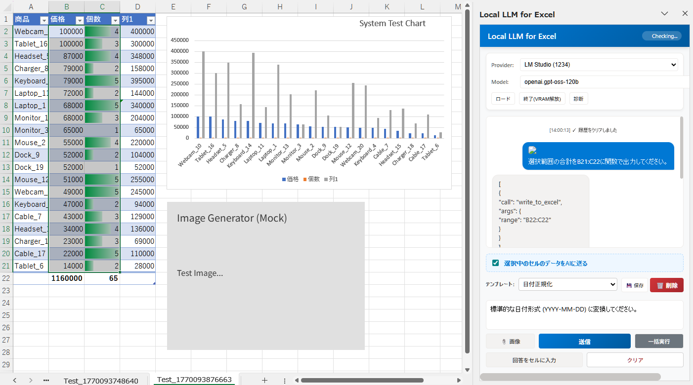

# Local LLM for Excel

**An Excel Add-in that automates tasks using Local LLMs (Ollama / LM Studio) or Google Gemini API.**
It runs on a lightweight Python server and requires no complex environment setup.



---

## 🌟 Key Features
1. **AI Chat & Control**: Chat with AI directly from the Excel side panel.
2. **Auto Formula Generation**: Generate formulas (`SUM`, `VLOOKUP`, etc.) from natural language instructions.
3. **Format & Charting**: Execute commands like "Make this a table," "Highlight in blue," or "Create a bar chart."
4. **Vision Capabilities**: Paste clipboard images and ask "Convert this table to Excel" (Supports Gemini / Ollama / LM Studio Vision models).
5. **Prompt Templates**: Use presets (Format, Cleanup, Translate) from the new dropdown menu.
6. **Batch Processing**: Run instructions row-by-row on the selected range using the "Batch Run" button.
7. **Custom Templates**: Save and manage your own prompts locally.
8. **System Test**: Built-in self-diagnosis tool for developers.

---

## 🚀 Setup Guide (Windows)

### 0. Prerequisites
- **Python (3.10+)**: [Download](https://www.python.org/)
  - Ensure **"Add Python to PATH"** is checked during installation.
- **Git (Optional)**: [Download](https://git-scm.com/) (Required only for cloning).
- **Microsoft Account**: You must be signed in to Excel.
- **Privacy Settings**: "Optional connected experiences" must be enabled (File > Options > Trust Center > Trust Center Settings > Privacy Options).

### 1. Server Preparation
1. **Clone or Download**:
   If you have Git, run:
   ```powershell
   git clone https://github.com/negiturkey/Local_LLM_for_Excel.git
   ```
   Or download the ZIP and extract it.

2. **Open Folder**: Right-click the `Local_LLM_for_Excel` folder and select "Open in Terminal".

2. **Gemini Setup (Optional)**:
   If using Google Gemini, create a `.env` file in this folder and save your API Key:
   ```ini
   GEMINI_API_KEY=ABCDE...
   ```
   *Create with Notepad and save as `.env` (no extension).*

3. **Start Local HTTP Server**:
   ```powershell
   python server/host.py
   ```
   → Setup is complete when `HTTP Server: http://localhost:3000/src/index.html` appears. **Keep this command prompt window open.**

### 2. Register to Excel (First Time Only)
To make Excel recognize this add-in, register this folder as a "Trusted Catalog".

1. **Prepare Shared Folder**:
   - Right-click `Local_LLM_for_Excel` folder → **Properties** → **Sharing** tab.
   - Click **Share...**, add yourself, and click "Share".
   - Copy the displayed "Network Path" (e.g., `\\Hostname\Local_LLM_for_Excel`).

2. **Configure in Excel**:
   - Open Excel → **File** → **Options** → **Trust Center** → **Trust Center Settings**.
   - Select **Trusted Add-in Catalogs** on the left menu.
   - Paste the copied path into "Catalog URL" and click **"Add Catalog"**.
   - Check **"Show in Menu"** for the added line and click OK.
   - **Restart Excel.**

3. **Insert Add-in**:
   - After restart, go to **Search** tab → **Insert Add-in** (or Get Add-ins → Shared Folder).
   - Select "Local LLM for Excel" from the **Shared Folder** tab and add it.

---

## 🤖 AI Provider Settings

### A. Google Gemini (Recommended / High Accuracy / Free Tier)
1. Select **Google Gemini (API)** in the provider dropdown.
2. The key loads automatically if set in `.env` (or enter manually).
3. Select a model (e.g., `gemini-1.5-pro`) and click "Load".

### B. Ollama (Local / Free)
1. Install from [Ollama Official Site](https://ollama.com/).
2. Run `ollama run llama3` (or `gemma2`) in terminal to download a model.
3. **Important**: Add `OLLAMA_ORIGINS="*"` to Windows Environment Variables and restart PC.
4. Select **Ollama** in the add-in and load.

### C. LM Studio (Local / Free)
1. Install and launch [LM Studio](https://lmstudio.ai/).
2. Go to **Local Server** tab on the left and click **Start Server**.
3. **Important**: Turn **ON** "Cross-Origin-Resource-Sharing (CORS)" in the settings on the right.
4. Select **LM Studio** in the add-in.

---

## 💡 Usage
Type your request in the input box at the bottom of the side panel.

- **"Multiply col C and D and output to col E as Sales"**
- **"Format A1 to E10 as a table with blue headers"**
- **"Put the sum of col F at the bottom"**
- **"Create a bar chart from this table"**

*Shift+Enter for new line, Enter to send.*

---

## ⚠️ Troubleshooting
- **Panel doesn't appear**:
  - Check if `python server/host.py` is running.
  - Retry `manifest.xml` upload.
- **Gemini Key not loading**:
  - Check if `.env` is named correctly (not `.env.txt`).
  - Restart the server (Ctrl+C and run host.py again).
- **"System Test"**:
  - Type "Run system test" ("システムテストを実行して") to run diagnostics.

---

## 📂 Folder Structure
```
Local_LLM_for_Excel/
├── .env                # API Key Config (User created)
├── manifest.xml        # Excel Config
├── server/             # Backend (Python)
│   └── host.py         # Main Server
└── src/                # Frontend (HTML/JS)
    ├── app.js          # Main Logic
    └── index.html      # UI Layout
```

<br>
<br>

---
---

# Local LLM for Excel (Japanese)

**ローカルLLM (Ollama / LM Studio) や Google Gemini API を活用して、Excel作業を自動化するアドインです。**
Pythonの超軽量サーバーのみで動作し、複雑な環境構築は不要です。


---

## 🌟 主な機能
1. **AIチャット & 操作**: Excel内でサイドパネルからAIと対話。
2. **数式自動生成**: 自然言語で指示すると、数式(`SUM`, `VLOOKUP`等)を自動入力。
3. **書式・グラフ作成**: 「テーブルにして」「青色で塗りつぶして」「棒グラフを作って」等を実行。
4. **画像認識 (Vision)**: クリップボードの画像を貼り付けて「表にして」が可能 (Gemini / Ollama / LM Studio Visionモデル対応)。
5.  **プロンプトテンプレート**: 新しいプルダウンメニューから、定型タスク（フォーマット、整理、翻訳）を選択可能。
6.  **バッチ処理**: 「一括実行」ボタンを使って、選択範囲の各行に対して行ごとに指示を実行可能。
7.  **カスタムテンプレート**: よく使うプロンプトを自分専用のテンプレートとして保存・管理できます。
8.  **システムテスト**: 開発者向け自己診断ツールを利用可能。

---

## 🚀 セットアップガイド (Windows)

### 0. 必須環境
- **Python (3.10以上)**: [ダウンロード](https://www.python.org/)
  - インストール時に **「Add Python to PATH」** にチェックを入れてください。
- **Git (任意)**: [ダウンロード](https://git-scm.com/) (クローンする場合のみ必要)。
- **Microsoft アカウント**: Excelでサインインしている必要があります。
- **プライバシー設定**: 「オプションの接続エクスペリエンス」を有効にする必要があります（ファイル > オプション > トラストセンター > トラストセンターの設定 > プライバシーオプション）。

### 1. サーバーの準備
1. **クローンまたはダウンロード**:
   Gitを使用する場合、以下を実行：
   ```powershell
   git clone https://github.com/negiturkey/Local_LLM_for_Excel.git
   ```
   または、GitHubからZIPファイルをダウンロードして展開してください。

2. **フォルダを開く**: `Local_LLM_for_Excel` フォルダを右クリックして「ターミナルで開く」を選択。

2. **Gemini設定 (任意)**:
   Google Gemini を使用する場合は、このフォルダ直下に `.env` ファイルを作成し、APIキーを保存してください。
   ```ini
   GEMINI_API_KEY=ABCDE...
   ```
   ※ メモ帳で作成し、ファイル名を `.env` （拡張子なし）として保存します。

3. **ローカルHTTPサーバー起動**:
   ```powershell
   python server/host.py
   ```
   → `HTTP Server: http://localhost:3000/src/index.html` と表示されれば準備完了です。このコマンドプロンプト画面はバックグラウンド処理のために**閉じずに**そのまま起動させておきます。

### 2. Excelへの登録 (初回のみ)
Excelにこのアドインを認識させるため、このフォルダを「信頼できるカタログ」として登録します。

1. **共有フォルダの準備**:
   - `Local_LLM_for_Excel` フォルダを右クリック → **プロパティ** → **共有**タブ。
   - **共有(S)...** をクリックし、自分自身を追加して「共有」ボタンを押します。
   - 表示された「ネットワークパス（例: `\\Hostname\Local_LLM_for_Excel`）」をコピーします。

2. **Excelでの設定**:
   - Excelを開き、**ファイル** → **オプション** → **トラストセンター** → **トラストセンターの設定**。
   - 左側メニューの **信頼できるアドインカタログ** を選択。
   - 「カタログのURL」にさきほどコピーしたパスを貼り付け、**「カタログの追加」** をクリック。
   - 追加された行の **「メニューに表示する」** にチェックを入れて OK で閉じます。
   - **Excelを一度再起動してください。**

3. **アドインの挿入**:
   - 再起動後、**検索**タブ → **アドインの挿入** (またはアドインを入手 → 共有フォルダー)。
   - **共有フォルダー** タブに「Local LLM for Excel」が表示されるので選択して追加します。

---

## 🤖 AIプロバイダーの設定

### A. Google Gemini (推奨・高精度・無料枠有り)
1. アドイン画面の Provider を **Google Gemini (API)** に変更。
2. APIキーを入力するか、`.env` を正しく設定していれば、自動的にキーが読み込まれます。
3. Model から `gemini-X.X-pro` などを選んで「ロード」ボタンを押してください。

### B. Ollama (ローカル・無料)
1. [Ollama公式サイト](https://ollama.com/) からインストール。
2. ターミナルで `ollama run llama3` (または `gemma2`) を実行してモデルをダウンロード。
3. **重要**: Windowsの環境変数に `OLLAMA_ORIGINS="*"` を追加してPCを再起動してください。
4. アドイン画面で **Ollama** を選択してロード。

### C. LM Studio (ローカル・無料)
1. [LM Studio公式サイト](https://lmstudio.ai/) からインストールして起動。
2. 左側メニューの **Local Server** タブを開き、緑色の **Start Server** をクリック。
3. **重要**: 右側の設定にある **Cross-Origin-Resource-Sharing (CORS)** を **ON** にしてください。
4. アドイン画面で **LM Studio** を選択。

---

## 💡 使い方
サイドパネルの下部にある入力欄にやりたいことを入力します。

- **「C列とD列を掛けてE列に売上として出して」**
- **「A1からE10をテーブルにして、見出しを青くして」**
- **「F列の合計を一番下に入れて」**
- **「この表から棒グラフを作って」**

※ Shift+Enterで改行、Enterで送信です。

---

## ⚠️ トラブルシューティング
- **右側にパネルが出ない**:
  - `python server/host.py` が実行中か確認してください。
  - `manifest.xml` のアップロードを再試行してください。
- **Geminiキーが読み込まれない**:
  - `.env` ファイル名が `.env.txt` になっていないか確認してください（拡張子を表示して確認）。
  - サーバー再起動が必要です（`host.py` の画面で Ctrl+C して再度実行）。
- **「システムテスト」**:
  - 「システムテストを実行して」と入力すると動作確認ができます。

---

## 📂 フォルダ構成
```
Local_LLM_for_Excel/
├── .env                # (ユーザー作成) APIキー設定
├── manifest.xml        # Excel用設定ファイル
├── server/             # サーバー (Python)
│   ├── host.py         # 本体
│   └── cert_gen.py     # 証明書作成
└── src/                # 画面 (HTML/JS)
    ├── app.js          # メイン処理
    └── index.html      # デザイン
```
